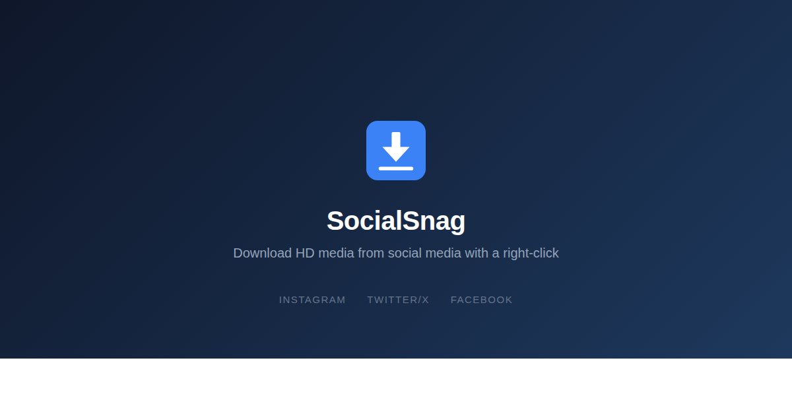

[](https://chromewebstore.google.com/detail/socialsnag/llbpeneloehnlaomolbalbmhjncpmnfa)


# SocialSnag

Right-click to download full-resolution images and videos from social media.

**[View the landing page](https://jamditis.github.io/socialsnag/)**



## Features

- **Right-click download** — context menu on any supported page, no copy-pasting URLs
- **HD quality** — rewrites CDN URLs to fetch the highest available resolution
- **Multi-image posts** — download all media from a carousel or gallery in one click
- **Video downloads** — Instagram reels and Twitter/X videos via platform API resolution
- **Download history** — track recent downloads from the popup
- **Organized folders** — files saved to `SocialSnag/<platform>/` automatically
- **Platform toggles** — enable or disable individual platforms from settings
- **Configurable download path** — choose where files are saved within your Downloads folder

## Supported platforms

- Instagram (images, reels, carousels)
- Twitter/X (images, profile pictures, videos)
- Facebook (images, videos)
- Bluesky (images)

## Install

### Chrome Web Store

**[Install from the Chrome Web Store](https://chromewebstore.google.com/detail/socialsnag/llbpeneloehnlaomolbalbmhjncpmnfa)**

### Developer mode

1. Clone and build:
   ```
   git clone https://github.com/jamditis/socialsnag.git
   cd socialsnag
   npm install && npm run build
   ```
2. Open `chrome://extensions` in your browser
3. Enable **Developer mode** (toggle in the top right)
4. Click **Load unpacked** and select the `dist/` folder
5. Navigate to a supported site and right-click any image or video

## Privacy

SocialSnag stores data locally in your browser and has no custom server component. Some non-sensitive settings (like platform toggles and advanced mode) use Chrome's sync storage and may be synced via Google if Chrome Sync is enabled in your browser. The extension does not collect analytics, telemetry, or personal information. See the [privacy policy](https://jamditis.github.io/socialsnag/privacy.html) for details.

## License

MIT. See [LICENSE](LICENSE).
